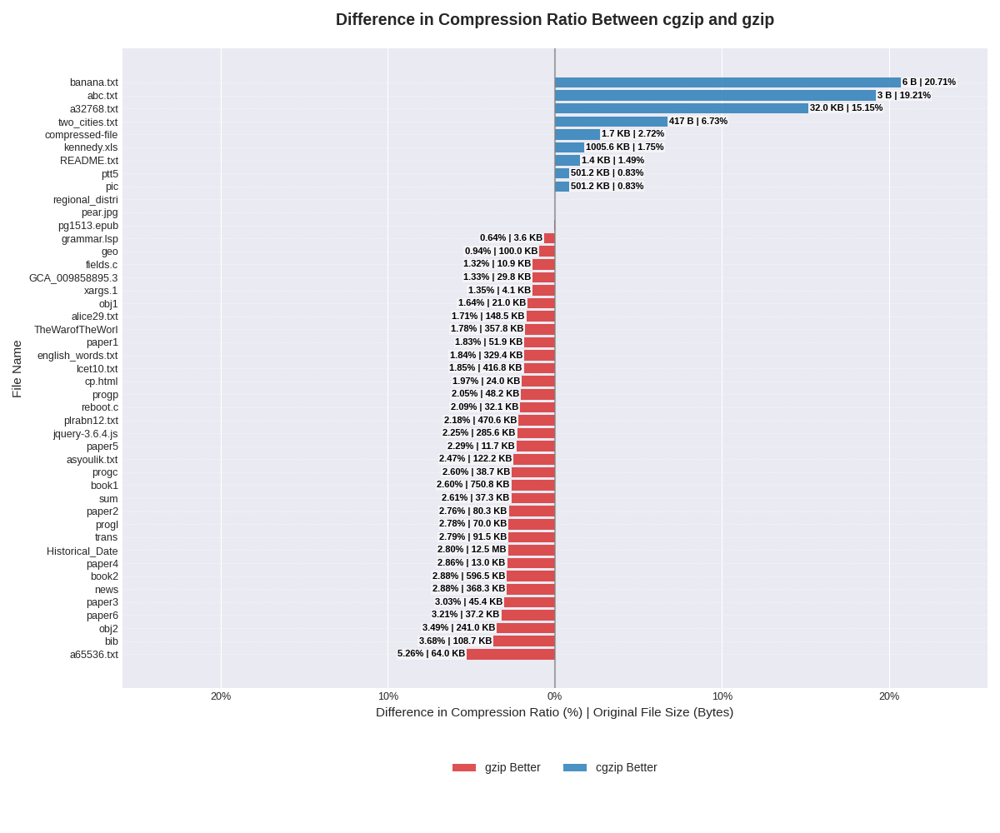

# cgzip

> *"c[allum's|ustom|ompressor for] gzip"*

`cgzip` is a standards-compliant GNU Gzip compressor, implemented from scratch using C++23. Files compressed using `cgzip` can be decompressed using `gzip -d`.

## Usage

Install the `cgzip` executable using CMake. An `install` make target is provided for convenience.

```console
❯ make install
```

`cgzip` accepts an input bitstream through stdin and outputs a compressed bitstream to stdout.

```console
❯ install/bin/cgzip < data/calgary_corpus/bib > bib.gz
```

Compressed files can be decompressed using any GNU Gzip decompressor.

```console
> gzip -cd bib.gz | diff - data/calgary_corpus/bib -s
Files - and data/calgary_corpus/bib are identical

❯ echo "original size = $(stat -c%s data/calgary_corpus/bib | numfmt --to=iec) bytes, compressed size = $(stat -c%s bib.gz | numfmt --to=iec) bytes"
original size = 109K bytes, compressed size = 36K bytes
```

## What is `cgzip` Really Doing?

A high-level description of GNU Gzip is in order!

GNU Gzip refers to both a file format and program. The `gzip` program understands the `.gz`
gzip file format, as well as the DEFLATE bitstream found within `.gz` files.
The `.gz` file format is a container format. Although originally designed to support multiple
compression formats, it was never expanded beyond a single compression format: DEFLATE.
The DEFLATE algorithm achieves compression by combining two tricks: LZSS and Huffman coding.

LZSS works by reusing previously-seen patterns through back-references.
Back-references are themselves pairs containing (1) the length of the pattern, and (2)
the distance backwards to the start of a previous occurrence of the pattern.
For instance, `ABCZABC` could be encoded as `ABCZ(3,4)`. Back-references can also overlap
into the future. For instance, `ABABABAB` could be encoded as `AB(6,2)`. In DEFLATE, back-references
are bounded to lengths of at least 3 and at most 258; distances are at most 2^15.

Huffman coding is used to determine optimal prefix code lengths for symbols. As Huffman coding is applied
after LZSS, possible symbols include literals (`A`, `B`, `C`, `Z` in the examples above), as well as
back-references (`(3,4)` and `(6,2)` in the examples above). Huffman coding ensures that symbols
are encoded efficiently according to their frequency. How Huffman code lengths are mapped to
prefix codes is, by nature, ambiguous. As the compressor and decompressor must share an
understanding of how Huffman code lengths map to actual prefix codes, this is problematic.
Thankfully, the RFC for DEFLATE ([RFC 1951](https://www.ietf.org/rfc/rfc1951.txt)) defines how prefix codes should be formed from lengths.
According to the RFC, the input `AABCCDC` would have the following prefix code lengths and codes:

| symbol | count | prefix code length | prefix code |
| --- | --- | --- | --- |
| `A` | 2 | 2 | 10 |
| `B` | 1 | 3 | 110 |
| `C` | 3 | 1 | 0 |
| `D` | 1 | 3 | 111 |

Although these two tricks are enough to achieve compression, a host of
additional techniques and considerations are involved in creating a GNU Gzip compressor.
For instance, DEFLATE supports three block types: block type 0, block type 1, and block type 2.
Block type 0 is uncompressed. Block type 1 is compressed using a hardcoded table of prefix codes.
Block type 2 is compressed using a custom table of prefix codes. The compressor chooses the sizes
and types of blocks. This gives rise to a number of design choices:

- How does the compressor choose the block types and block sizes?
- How is the custom prefix code table communicated to the decompressor?
- How is the custom prefix code table itself compressed using another hardcoded prefix code table?
- How are the custom prefix code lengths derived such that the maximum length is upper-bounded by DEFLATE's maximum of 15?
- How are back-references found efficiently?
- If multiple back-references exist, which should be used, given that Huffman coding will later be applied?
- What if encoding a set of literals directly is more efficient than using a back-reference?
- ...

As the DEFLATE specification only defines the protocol between the compressor
and decompressor, there is significant leeway in terms of how these questions can be answered.
The decompressor is "dumb" in the sense that it does not expect these questions to be answered in any specific way;
it just understands how to reverse the effects of Huffman coding and LZSS.
This allows iterative algorithmic improvements to GNU Gzip compressors without requiring changes to the
specification or decompressors. This also means **any two implementations of a GNU Gzip compressor can achieve different
compression and speed, and it is up to the designer of a given compressor to address the significant number
of design choices**.

## Design Choices

The following sections describe some of the design choices taken in `cgzip`
(make sure to read [What is `cgzip` Really Doing?](#what-is-cgzip-really-doing)
first to understand how design choices like these are required under the DEFLATE specification!).

### Huffman Coding

Package merge is used to generate Huffman code lengths based on symbol frequencies. See the [implementation](include/package_merge.hpp) and [reference](https://people.eng.unimelb.edu.au/ammoffat/abstracts/compsurv19moffat.pdf) for more details. Huffman code lengths are translated into prefix codes according to [RFC 1951](https://www.ietf.org/rfc/rfc1951.txt). See the [implementation](include/prefix_codes.hpp) for more details.

### LZSS

Ring buffers are used to represent look-ahead and look-back buffers, ensuring
that memory overhead is upper-bounded by the maximum look-ahead and look-back
sizes. The position of the most recent occurrence of each length-three pattern 
is represented in a hash map. An additional ring buffer is used to represent 
the "chain" of additional occurrences of the same pattern in the look-back 
buffer. For example, the hash map could indicate that the pattern "ABC"
occurred at position 100 in the look-back buffer. At the same position in the
chain buffer, there could be an entry with the value 90, indicating that
the pattern "ABC" previously occurred at position 90. In this fashion,
the full set of positions for "ABC" are cached in the hash map and chain 
buffer. See the [implementation](include/lzss.hpp) for more details.

### Optimized Block Type 2 Header

The block type 2 header is optimized to reduce the number of bits required
to represent the header in the presence of trailing zero-length 
meta-prefix-codes. See the [implementation](include/block_type_2.hpp) for more details.

### Adaptive Block Sizing

The block size is dynamically determined based on a CUSUM algorithm for
change-point detection in a categorical data stream. This [article](https://sarem-seitz.com/posts/probabilistic-cusum-for-change-point-detection.html)
gives a good overview of the algorithm for the numerical data stream case.
To adapt the algorithm for the categorical data stream case, the probability
of each symbol is tracked, rather than the mean of the data stream. Using
the log-likelihood ratio, the algorithm determines whether the probability
of the current symbol is more likely given the current distribution, rather 
than the distribution from the warmup period. Once the cumulative sum of log-likelihood ratios
has accumulated beyond a threshold, the distribution of the data stream is deemed to have
shifted, and a change-point is reported. A new block is then created. See the 
[implementation](include/change_point_detection.hpp) for more details.

### Adaptive Block Type Selection

The optimal block type is selected by simulating the contents of each block 
type and comparing the number of bits. Due to the warmup period required
for change-point detection, the minimum size of a block is 2^13 bytes.
In practice, this is larger than desirable for a block of type 1, as
beyond this size, the overhead of block type 2 is relatively small,
making block type 2 preferable in essentially all cases. Since block type 1
will never be used, it is disabled to improve speed. It can be re-enabled
by increasing the breakpoint value for block type 1 from 0 to a value larger than 2^13
in [main.cpp](app/main.cpp), allowing block type 1 to be considered.

## Benchmarks

The `data/` folder contains all files used for [speed](#speed) and [compression ratio](#compression-ratio) benchmarks.
Within the `data/` folder are two corpora frequently used in the domain of data compression for evaluating the performance
of different compression schemes: the [Calgary](./data/calgary_corpus/) and [Canterbury](./data/canterbury_corpus/) corpora.
Additional custom corpora are also included.

The [`dust`](https://github.com/bootandy/dust) output below illustrates the absolute and relative file sizes within the `data/` folder.

```console
> dust data
 4.0K     ┌── abc.txt                           │█░░                                                                                                                           │   0%
 4.0K     ├── banana.txt                        │█░░                                                                                                                           │   0%
 4.0K     ├── two_cities.txt                    │█░░                                                                                                                           │   0%
  32K     ├── a32768.txt                        │█░░                                                                                                                           │   0%
  64K     ├── a65536.txt                        │█░░                                                                                                                           │   0%
 332K     ├── english_words.txt                 │███                                                                                                                           │   2%
 444K   ┌─┴ other                               │███                                                                                                                           │   2%
 4.0K   │ ┌── grammar.lsp                       │█░░░░░░░░░░░░░░░░                                                                                                             │   0%
 8.0K   │ ├── xargs.1                           │█░░░░░░░░░░░░░░░░                                                                                                             │   0%
  12K   │ ├── fields.c                          │█░░░░░░░░░░░░░░░░                                                                                                             │   0%
  28K   │ ├── cp.html                           │█░░░░░░░░░░░░░░░░                                                                                                             │   0%
  40K   │ ├── sum                               │█░░░░░░░░░░░░░░░░                                                                                                             │   0%
 124K   │ ├── asyoulik.txt                      │█░░░░░░░░░░░░░░░░                                                                                                             │   1%
 152K   │ ├── alice29.txt                       │█░░░░░░░░░░░░░░░░                                                                                                             │   1%
 420K   │ ├── lcet10.txt                        │███░░░░░░░░░░░░░░                                                                                                             │   2%
 472K   │ ├── plrabn12.txt                      │███░░░░░░░░░░░░░░                                                                                                             │   2%
 504K   │ ├── ptt5                              │████░░░░░░░░░░░░░                                                                                                             │   2%
1008K   │ ├── kennedy.xls                       │███████░░░░░░░░░░                                                                                                             │   5%
 2.7M   ├─┴ canterbury_corpus                   │█████████████████                                                                                                             │  14%
  12K   │ ┌── paper5                            │█░░░░░░░░░░░░░░░░░░░                                                                                                          │   0%
  16K   │ ├── paper4                            │█░░░░░░░░░░░░░░░░░░░                                                                                                          │   0%
  24K   │ ├── obj1                              │█░░░░░░░░░░░░░░░░░░░                                                                                                          │   0%
  40K   │ ├── paper6                            │█░░░░░░░░░░░░░░░░░░░                                                                                                          │   0%
  40K   │ ├── progc                             │█░░░░░░░░░░░░░░░░░░░                                                                                                          │   0%
  48K   │ ├── paper3                            │█░░░░░░░░░░░░░░░░░░░                                                                                                          │   0%
  52K   │ ├── paper1                            │█░░░░░░░░░░░░░░░░░░░                                                                                                          │   0%
  52K   │ ├── progp                             │█░░░░░░░░░░░░░░░░░░░                                                                                                          │   0%
  72K   │ ├── progl                             │█░░░░░░░░░░░░░░░░░░░                                                                                                          │   0%
  84K   │ ├── paper2                            │█░░░░░░░░░░░░░░░░░░░                                                                                                          │   0%
  92K   │ ├── trans                             │█░░░░░░░░░░░░░░░░░░░                                                                                                          │   0%
 100K   │ ├── geo                               │█░░░░░░░░░░░░░░░░░░░                                                                                                          │   0%
 112K   │ ├── bib                               │█░░░░░░░░░░░░░░░░░░░                                                                                                          │   1%
 244K   │ ├── obj2                              │██░░░░░░░░░░░░░░░░░░                                                                                                          │   1%
 372K   │ ├── news                              │███░░░░░░░░░░░░░░░░░                                                                                                          │   2%
 504K   │ ├── pic                               │████░░░░░░░░░░░░░░░░                                                                                                          │   2%
 600K   │ ├── book2                             │████░░░░░░░░░░░░░░░░                                                                                                          │   3%
 752K   │ ├── book1                             │█████░░░░░░░░░░░░░░░                                                                                                          │   4%
 3.1M   ├─┴ calgary_corpus                      │████████████████████                                                                                                          │  16%
 4.0K   │ ┌── README.txt                        │█░░░░░░░░░░░░░░░░░░░░░░░░░░░░░░░░░░░░░░░░░░░░░░░░░░░░░░░░░░░░░░░░░░░░░░░░░░░░░░░░░░░░░                                        │   0%
 4.0K   │ ├── compressed-file-svgrepo-com.svg   │█░░░░░░░░░░░░░░░░░░░░░░░░░░░░░░░░░░░░░░░░░░░░░░░░░░░░░░░░░░░░░░░░░░░░░░░░░░░░░░░░░░░░░                                        │   0%
  32K   │ ├── GCA_009858895.3.fasta             │█░░░░░░░░░░░░░░░░░░░░░░░░░░░░░░░░░░░░░░░░░░░░░░░░░░░░░░░░░░░░░░░░░░░░░░░░░░░░░░░░░░░░░                                        │   0%
  36K   │ ├── reboot.c                          │█░░░░░░░░░░░░░░░░░░░░░░░░░░░░░░░░░░░░░░░░░░░░░░░░░░░░░░░░░░░░░░░░░░░░░░░░░░░░░░░░░░░░░                                        │   0%
 144K   │ ├── pg1513.epub                       │█░░░░░░░░░░░░░░░░░░░░░░░░░░░░░░░░░░░░░░░░░░░░░░░░░░░░░░░░░░░░░░░░░░░░░░░░░░░░░░░░░░░░░                                        │   1%
 164K   │ ├── pear.jpg                          │█░░░░░░░░░░░░░░░░░░░░░░░░░░░░░░░░░░░░░░░░░░░░░░░░░░░░░░░░░░░░░░░░░░░░░░░░░░░░░░░░░░░░░                                        │   1%
 256K   │ ├── regional_district_weekly_2021.xlsx│██░░░░░░░░░░░░░░░░░░░░░░░░░░░░░░░░░░░░░░░░░░░░░░░░░░░░░░░░░░░░░░░░░░░░░░░░░░░░░░░░░░░░                                        │   1%
 288K   │ ├── jquery-3.6.4.js                   │██░░░░░░░░░░░░░░░░░░░░░░░░░░░░░░░░░░░░░░░░░░░░░░░░░░░░░░░░░░░░░░░░░░░░░░░░░░░░░░░░░░░░                                        │   1%
 360K   │ ├── TheWarofTheWorlds.txt             │███░░░░░░░░░░░░░░░░░░░░░░░░░░░░░░░░░░░░░░░░░░░░░░░░░░░░░░░░░░░░░░░░░░░░░░░░░░░░░░░░░░░                                        │   2%
  12M   │ ├── Historical_Dates.json             │██████████████████████████████████████████████████████████████████████████████░░░░░░░░                                        │  62%
  13M   ├─┴ millbay_corpus                      │██████████████████████████████████████████████████████████████████████████████████████                                        │  69%
  20M ┌─┴ data                                  │█████████████████████████████████████████████████████████████████████████████████████████████████████████████████████████████ │ 100%
```

### Speed

> "Speed" is used here instead of "performance" as "performance" may refer to speed or compression ratio.

The following system was used for benchmarking.

```console
❯ fastfetch
          ▗▄▄▄       ▗▄▄▄▄    ▄▄▄▖             callumcurtis@wind
          ▜███▙       ▜███▙  ▟███▛             -----------------
           ▜███▙       ▜███▙▟███▛              OS: NixOS 25.05 (Warbler) x86_64
            ▜███▙       ▜██████▛               Kernel: Linux 6.12.45
     ▟█████████████████▙ ▜████▛     ▟▙         Uptime: 28 mins
    ▟███████████████████▙ ▜███▙    ▟██▙        Packages: 2252 (nix-system)
           ▄▄▄▄▖           ▜███▙  ▟███▛        Shell: bash 5.2.37
          ▟███▛             ▜██▛ ▟███▛         Display (VG27A): 2560x1440 @ 165 Hz in 27" [External]
         ▟███▛               ▜▛ ▟███▛          Display (VG27A): 1440x2560 @ 165 Hz in 27" [External]
▟███████████▛                  ▟██████████▙    WM: Hyprland 0.51.0 (Wayland)
▜██████████▛                  ▟███████████▛    Theme: adw-gtk3 [GTK2/3/4]
      ▟███▛ ▟▙               ▟███▛             Font: DejaVu Sans (10pt) [GTK2/3/4]
     ▟███▛ ▟██▙             ▟███▛              Cursor: Bibata-Original-Ice (24px)
    ▟███▛  ▜███▙           ▝▀▀▀▀               Terminal: zellij 0.43.1
    ▜██▛    ▜███▙ ▜██████████████████▛         CPU: AMD Ryzen 9 5900X (24) @ 3.70 GHz
     ▜▛     ▟████▙ ▜████████████████▛          GPU: NVIDIA GeForce RTX 3070 [Discrete]
           ▟██████▙       ▜███▙                Memory: 4.57 GiB / 31.23 GiB (15%)
          ▟███▛▜███▙       ▜███▙               Swap: Disabled
         ▟███▛  ▜███▙       ▜███▙              Disk (/): 0 B / 15.61 GiB (0%) - tmpfs
         ▝▀▀▀    ▀▀▀▀▘       ▀▀▀▘              Disk (/nix): 70.11 GiB / 301.06 GiB (23%) - ext4 [Read-only]
```

The `data/` folder was combined into a single `data.tar` archive of size 20MB.

```console
❯ tar -cf data.tar data
❯ stat -c%s data.tar | numfmt --to=iec
20M
```

The archive was then compressed using `cgzip` and benchmarked using [`hyperfine`](https://github.com/sharkdp/hyperfine).

```console
❯ hyperfine './install/bin/cgzip < data.tar > data.tar.gz'
Benchmark 1: ./install/bin/cgzip < data.tar > data.tar.gz
  Time (mean ± σ):     14.224 s ±  0.624 s    [User: 14.148 s, System: 0.017 s]
  Range (min … max):   13.232 s … 15.102 s    10 runs
```

### Compression Ratio

The chart below compares `cgzip` and `gzip` compression ratios across all files in the `data/` folder.



The following `gzip` version was used in the comparison (using the default compression level of 6):

```console
❯ gzip --version
gzip 1.14
Copyright (C) 2025 Free Software Foundation, Inc.
Copyright (C) 1993 Jean-loup Gailly.
This is free software.  You may redistribute copies of it under the terms of
the GNU General Public License <https://www.gnu.org/licenses/gpl.html>.
There is NO WARRANTY, to the extent permitted by law.

Written by Jean-loup Gailly.
```
