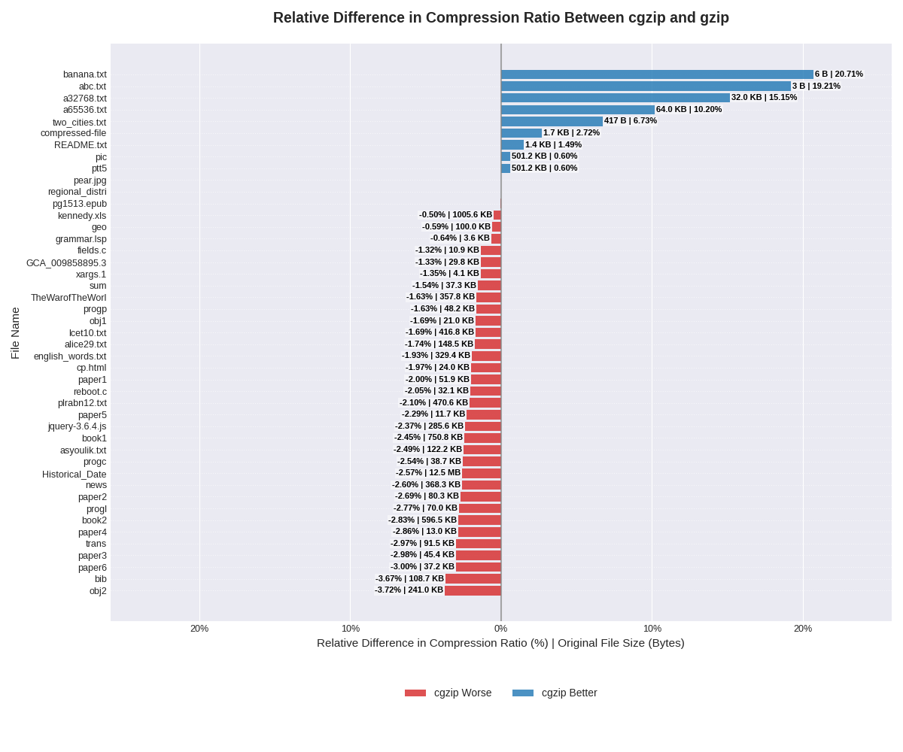

# cgzip

> *"c[allum's|ustom|ompressor for] gzip"*

`cgzip` is a standards-compliant GNU Gzip compressor, implemented from scratch using C++23. Files compressed using `cgzip` can be decompressed using `gzip -d`.

## Usage

Install the `cgzip` executable using CMake. An `install` Makefile target is provided for convenience.

```shell
❯ make install
```

`cgzip` accepts an input bitstream through stdin and outputs a compressed bitstream to stdout.

```shell
❯ install/bin/cgzip < data/calgary_corpus/bib > bib.gz
```

Compressed files can be decompressed using any GNU Gzip decompressor.

```shell
> gzip -cd bib.gz | diff - data/calgary_corpus/bib -s
Files - and data/calgary_corpus/bib are identical

❯ echo "original size = $(stat -c%s data/calgary_corpus/bib) bytes, compressed size = $(stat -c%s bib.gz) bytes"
original size = 111261 bytes, compressed size = 36403 bytes
```

## Speed

Using the following system:

```
          ▗▄▄▄       ▗▄▄▄▄    ▄▄▄▖             callumcurtis@wind
          ▜███▙       ▜███▙  ▟███▛             -----------------
           ▜███▙       ▜███▙▟███▛              OS: NixOS 25.05 (Warbler) x86_64
            ▜███▙       ▜██████▛               Kernel: Linux 6.12.45
     ▟█████████████████▙ ▜████▛     ▟▙         Uptime: 28 mins
    ▟███████████████████▙ ▜███▙    ▟██▙        Packages: 2252 (nix-system)
           ▄▄▄▄▖           ▜███▙  ▟███▛        Shell: bash 5.2.37
          ▟███▛             ▜██▛ ▟███▛         Display (VG27A): 2560x1440 @ 165 Hz in 27" [External]
         ▟███▛               ▜▛ ▟███▛          Display (VG27A): 1440x2560 @ 165 Hz in 27" [External]
▟███████████▛                  ▟██████████▙    WM: Hyprland 0.51.0 (Wayland)
▜██████████▛                  ▟███████████▛    Theme: adw-gtk3 [GTK2/3/4]
      ▟███▛ ▟▙               ▟███▛             Font: DejaVu Sans (10pt) [GTK2/3/4]
     ▟███▛ ▟██▙             ▟███▛              Cursor: Bibata-Original-Ice (24px)
    ▟███▛  ▜███▙           ▝▀▀▀▀               Terminal: zellij 0.43.1
    ▜██▛    ▜███▙ ▜██████████████████▛         CPU: AMD Ryzen 9 5900X (24) @ 3.70 GHz
     ▜▛     ▟████▙ ▜████████████████▛          GPU: NVIDIA GeForce RTX 3070 [Discrete]
           ▟██████▙       ▜███▙                Memory: 4.57 GiB / 31.23 GiB (15%)
          ▟███▛▜███▙       ▜███▙               Swap: Disabled
         ▟███▛  ▜███▙       ▜███▙              Disk (/): 0 B / 15.61 GiB (0%) - tmpfs
         ▝▀▀▀    ▀▀▀▀▘       ▀▀▀▘              Disk (/nix): 70.11 GiB / 301.06 GiB (23%) - ext4 [Read-only]
```

The following performance results were achieved by compressing a `data.tar` file (21MB) created from the `data/` folder.

```
❯ hyperfine './install/bin/cgzip < data.tar > data.tar.gz'
Benchmark 1: ./install/bin/cgzip < data.tar > data.tar.gz
  Time (mean ± σ):     14.224 s ±  0.624 s    [User: 14.148 s, System: 0.017 s]
  Range (min … max):   13.232 s … 15.102 s    10 runs
```

## Compression Ratio

The chart below compares `cgzip` and `gzip` compression ratios across all files in the `data/` folder.



The following `gzip` version was used in the comparison (using the default compression level of 6):

```bash
❯ gzip --version
gzip 1.14
Copyright (C) 2025 Free Software Foundation, Inc.
Copyright (C) 1993 Jean-loup Gailly.
This is free software.  You may redistribute copies of it under the terms of
the GNU General Public License <https://www.gnu.org/licenses/gpl.html>.
There is NO WARRANTY, to the extent permitted by law.

Written by Jean-loup Gailly.
```

## Features

### Huffman Coding

Package merge is used to generate Huffman code lengths based on symbol frequencies. See the [implementation](include/package_merge.hpp) and [reference](https://people.eng.unimelb.edu.au/ammoffat/abstracts/compsurv19moffat.pdf) for more details.

Huffman code lengths are translated into prefix codes according to [RFC 1951](https://www.ietf.org/rfc/rfc1951.txt). See the [implementation](include/prefix_codes.hpp) for more details.

### LZSS

Ring buffers are used to represent look-ahead and look-back buffers, ensuring
that memory overhead is upper-bounded by the maximum look-ahead and look-back
sizes. The position of the most recent occurrence of each length-three pattern 
is represented in a hash map. An additional ring buffer is used to represent 
the "chain" of additional occurrences of the same pattern in the look-back 
buffer. For example, the hash map could indicate that the pattern "ABC"
occurred at position 100 in the look-back buffer. At the same position in the
chain buffer, there could be an entry with the value 90, indicating that
the pattern "ABC" previously occurred at position 90. In this fashion,
the full set of positions for "ABC" are cached in the hash map and chain 
buffer. See the [implementation](include/lzss.hpp) for more details.

### Optimized Block Type 2 Header

The block type 2 header is optimized to reduce the number of bits required
to represent the header in the presence of trailing zero-length 
meta-prefix-codes. See the [implementation](include/block_type_2.hpp) for more details.

### Adaptive Block Sizing

The block size is dynamically determined based on a CUSUM algorithm for
change-point detection in a categorical data stream. This [article](https://sarem-seitz.com/posts/probabilistic-cusum-for-change-point-detection.html)
gives a good overview of the algorithm for the numerical data stream case.
To adapt the algorithm for the categorical data stream case, the probability
of each symbol is tracked, rather than the mean of the data stream. Using
the log-likelihood ratio, the algorithm determines whether the probability
of the current symbol is more likely given the current distribution, rather 
than the distribution from the warmup period. Once the log-likelihood ratio
has accumulated enough, the distribution of the data stream is deemed to have
shifted, and a change-point is reported. A new block is then created. See the 
[implementation](include/change_point_detection.hpp) for more details.

### Adaptive Block Type Selection

The optimal block type is selected by simulating the contents of each block 
type and comparing the number of bits. Due to the warmup period required
for change-point detection, the minimum size of a block is `2^13` bytes.
In practice, this is larger than desirable for a block of type 1, as
beyond this size, the overhead of block type 2 is relatively small,
making block type 2 preferable in essentially all cases. Since block type 1
will never be used, it is disabled to improve speed. It can be re-enabled
by increasing the breakpoint value for block type 1 from `0` to a value larger than `2^13`
in [main.cpp](app/main.cpp), allowing block type 1 to be considered.
